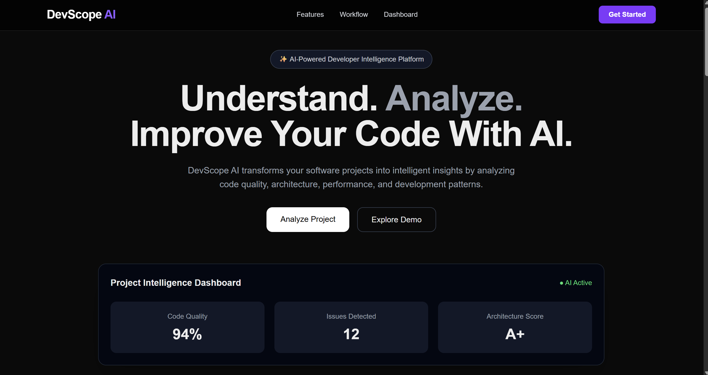
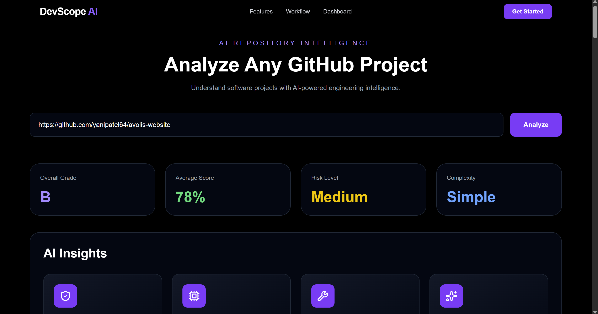
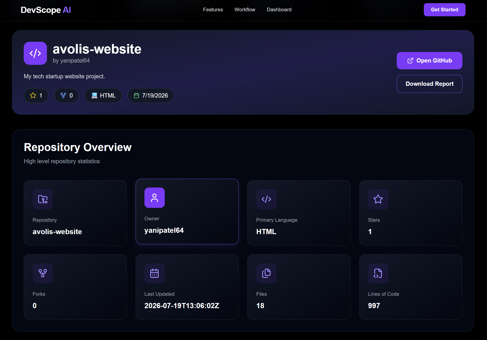
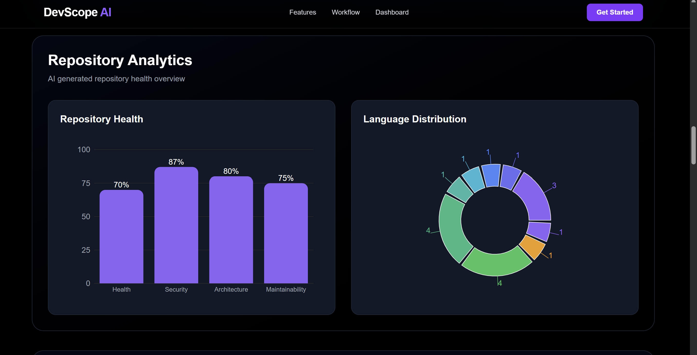
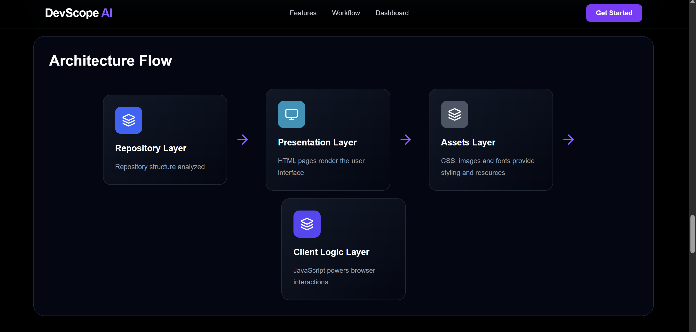
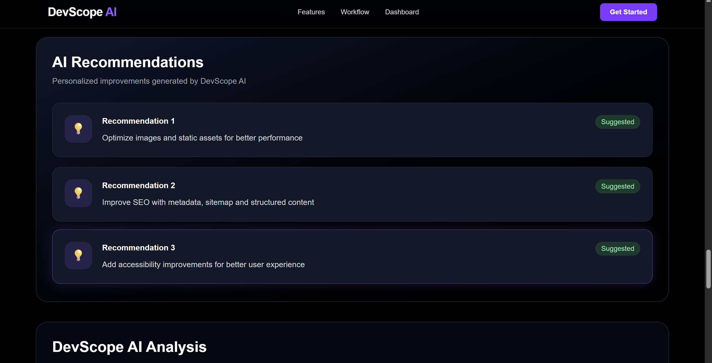
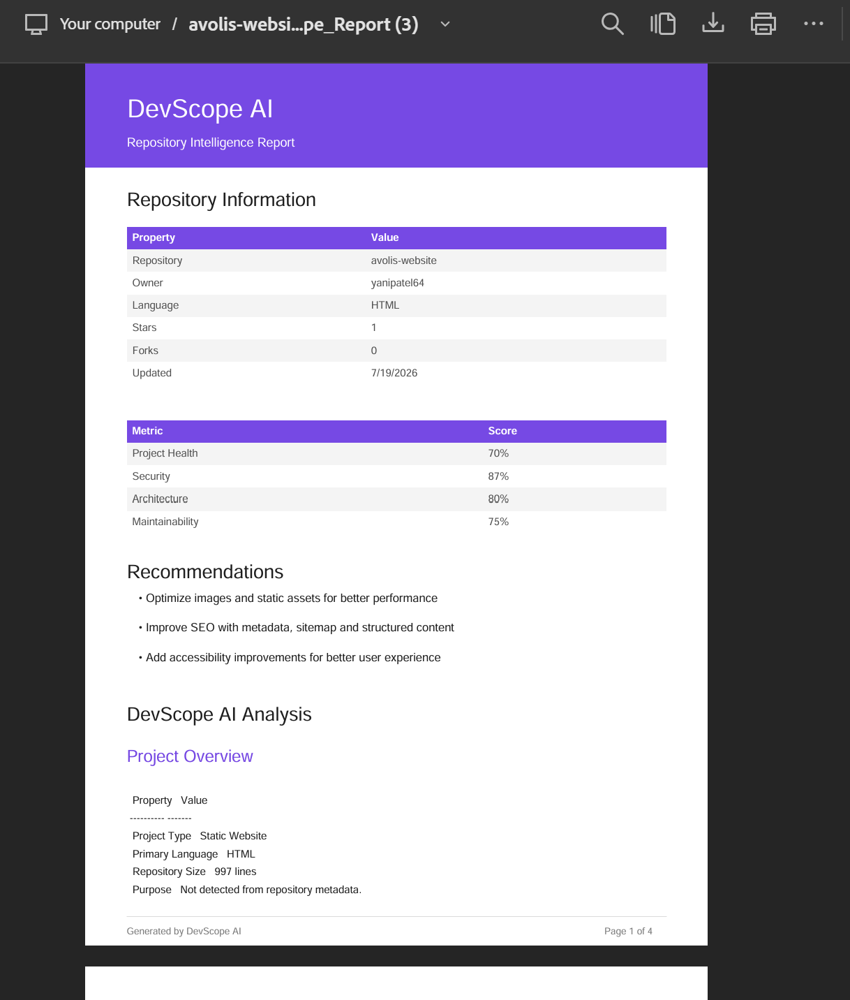

# 🚀 DevScope AI

> AI-powered GitHub Repository Intelligence Platform for analyzing software repositories, evaluating engineering quality, visualizing architecture, and generating comprehensive AI-driven reports.

<p align="center">


</p>

---

# 🌐 Live Demo

### 🚀 Frontend

https://devscope-ai-delta.vercel.app

### 📂 GitHub Repository

https://github.com/yanipatel64/devscope-ai

---

# 📖 Overview

DevScope AI is an AI-powered repository intelligence platform that transforms GitHub repositories into actionable engineering insights.

Instead of manually exploring project structures, users can submit a GitHub repository URL and receive a detailed engineering analysis including repository health, security evaluation, architecture insights, maintainability metrics, language distribution, repository exploration, AI-generated recommendations, and downloadable intelligence reports.

The platform combines automated repository scanning with Google's Gemini AI to generate comprehensive engineering documentation within seconds.

---

# ✨ Key Features

- 🤖 AI-powered repository intelligence
- 📊 Engineering quality scoring
- 🔒 Security analysis
- 🏗 Architecture visualization
- 📁 Repository Explorer
- 📈 Repository analytics dashboard
- 📚 Language distribution analysis
- 💡 AI-generated engineering recommendations
- 📝 Executive engineering summary
- 📄 Markdown intelligence report
- 📥 PDF report generation
- 🌙 Modern responsive interface
- ⚡ Fast real-time repository analysis

---

# 🏛 Architecture

```
                GitHub Repository
                        │
                        ▼
              Repository Scanner
                        │
                        ▼
              Repository Analyzer
                        │
                        ▼
             Engineering Metrics
                        │
                        ▼
                 Google Gemini AI
                        │
                        ▼
            Engineering Intelligence
                        │
        ┌───────────────┼───────────────┐
        ▼               ▼               ▼
 Dashboard        AI Recommendations    PDF Report
```

---

# ⚙ Tech Stack

## Frontend

- Next.js 16
- React
- TypeScript
- Tailwind CSS
- Recharts
- React Markdown

## Backend

- FastAPI
- Python
- GitPython
- Pydantic

## Artificial Intelligence

- Google Gemini API

## Deployment

- Vercel
- Render

## Utilities

- jsPDF
- GitHub REST API

---

# 📊 Analysis Workflow

```
GitHub Repository URL
          │
          ▼
Clone Repository
          │
          ▼
Repository Scanner
          │
          ▼
Repository Metrics Extraction
          │
          ▼
Architecture Analysis
          │
          ▼
Security Evaluation
          │
          ▼
AI Repository Intelligence
          │
          ▼
Interactive Dashboard
          │
          ▼
Engineering Report & PDF Export
```

---

# 📂 Project Structure

```
devscope-ai/

├── frontend/
│   ├── app/
│   ├── components/
│   ├── context/
│   ├── types/
│   └── public/
│
├── backend/
│   ├── app/
│   │   ├── api/
│   │   ├── services/
│   │   ├── models/
│   │   └── core/
│   └── requirements.txt
│
└── README.md
```

---

# 📈 Dashboard Highlights

The platform provides:

- Executive Engineering Summary
- Repository Overview
- Engineering Health Scores
- Security Analysis
- Architecture Flow
- Repository Explorer
- Repository Analytics
- AI Recommendations
- Markdown Intelligence Report
- PDF Intelligence Report

---

# 📸 Screenshots

## Landing Page



---

## Engineering Dashboard



---

## Repository Overview



---

## Repository Analytics



---

## Architecture Flow



---

## AI Recommendations



---

## AI Intelligence PDF Report



---

# 🚀 Installation

## Clone Repository

```bash
git clone https://github.com/yanipatel64/devscope-ai.git
```

## Backend

```bash
cd backend

pip install -r requirements.txt

uvicorn app.main:app --reload
```

## Frontend

```bash
cd frontend

npm install

npm run dev
```

---

# 💻 Usage

1. Open the application.
2. Paste a public GitHub repository URL.
3. Start repository analysis.
4. Review engineering insights.
5. Explore architecture and analytics.
6. Download the AI-generated PDF report.

---

# 🎯 Future Enhancements

- Repository comparison
- Pull Request intelligence
- Commit history analysis
- Contributor analytics
- CI/CD inspection
- Dependency visualization
- Code smell detection
- Repository trend tracking
- Team dashboard
- Authentication & user history

---

# 🤝 Contributing

Contributions, feature suggestions, and improvements are welcome.

Feel free to fork the repository and submit a pull request.

---

# 📄 License

This project is licensed under the MIT License.

---

# ⭐ Support

If you found this project useful, consider giving it a ⭐ on GitHub.

It helps others discover the project and supports future development.

---

<p align="center">

Built with ❤️ using Next.js, FastAPI, and Google Gemini AI.

</p>
